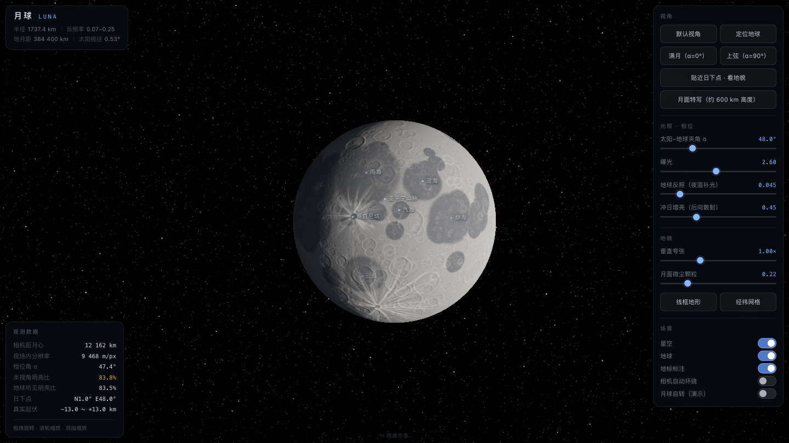
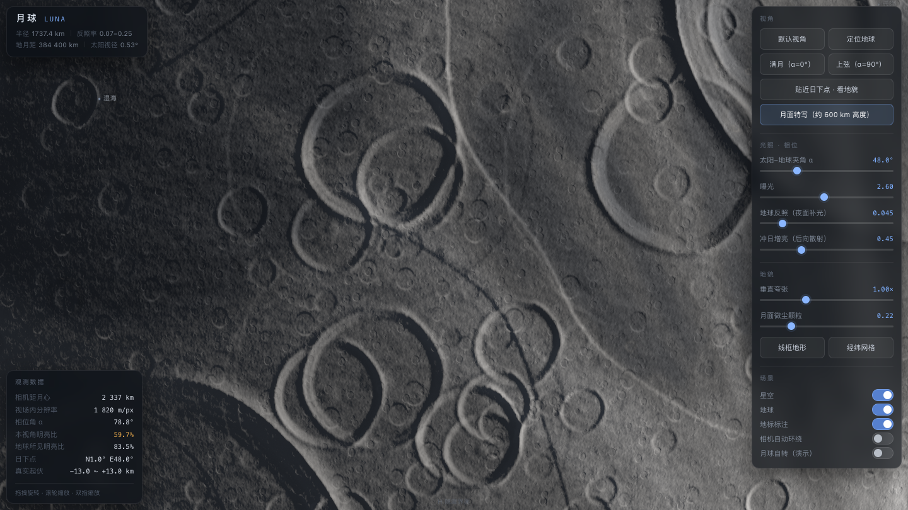

# 🌙 月球 LUNA · 观测器

**浏览器里的 3D 月球**。用 NASA 实测数据渲染真实月面（LRO 激光测高 + 广角相机全球底图），
再叠上程序化生成的月壤微细节，复刻抖音上那套「月球观测」界面。

**在线体验 → https://hruiccc.github.io/RuiC-Luna/** （不用装任何东西，真实数据模式直接可用）



近景 —— 真实地形 + 程序化月壤颗粒：



---

## 亮点

- **真实月面**：LRO **LOLA** 激光测高（5760×2880）+ **LROC WAC** 全球底图（4096×2048）。
  月海轮廓、撞击坑形状、辐射纹分布全部是实测的，起伏读数是真实值 **−10.7 ~ +9.0 km**
- **三层细节体系**：烘焙法线 + 解析梯度程序化微坑场 + 平铺月壤细节图，各带独立 LOD 管理，
  **从 90 万 km 到 36 km 高度，任意缩放都有细节且不闪烁**
- **看得见物理**：月面散射用 Lommel–Seeliger 型（月面几乎没有临边昏暗）、冲日增亮（后向散射）、
  地球反照（夜面那层淡淡的蓝）、1.54° 天平动倾角（所以日下点纬度不是 0）
- **观测数据全部实时反算**：相机距月心、视场内分辨率、相位角、明亮比、日下点、真实起伏——
  由当前机位与高程数据当场算出来，不是写死的数字
- **零依赖**：没有框架、没有构建、没有 CDN，`index.html` 一个文件就是全部代码

---

## 三种打开方式

| 方式 | 怎么做 | 说明 |
| --- | --- | --- |
| **在线版** | 打开 https://hruiccc.github.io/RuiC-Luna/ | 最省事，真实数据模式直接可用 |
| **本地 + 真实数据** | 双击 `启动.command` | 起本地服务器并自动开浏览器，关掉终端窗口即停止 |
| **本地 + 程序化** | 双击 `index.html` | 完全离线，月面在浏览器里实时生成（约 6 秒进度条） |

> 真实数据必须经 HTTP 读取——浏览器不允许 `file://` 页面读本地二进制文件。
> 直接用 `file://` 打开时页面会自动回退到程序化生成，左下角会显示当前用的是哪种数据。

---

## 操作

| 操作 | 效果 |
| --- | --- |
| 拖拽 | 旋转视角（带惯性） |
| 滚轮 / 双指 | 缩放（1.02 ~ 520 个月球半径，约 36 km ~ 90 万 km 高度） |
| 双击 | 回到默认视角 |
| **H** | 隐藏 / 显示全部界面 |

---

## 功能详解

### 视角预设（6 个）

| 按钮 | 取景 |
| --- | --- |
| 默认视角 | 地球方向正视，还原视频开场构图 |
| 定位地球 | 转身面对地球，星空里那弯地球带着大气辉光，随相位变盈缺 |
| 满月（α=0°） | 太阳与地球同向，相位归零 |
| 上弦（α=90°） | 太阳与视线垂直，看明暗界线切过盘面 |
| 贴近日下点 · 看地貌 | 约 1200 km 高度斜视晨昏线，地平线与明暗分界同框 |
| 月面特写（约 600 km 高度） | 俯拍晨昏线附近，太阳高度约 10° —— 坑唇被侧光照亮、坑底沉在黑里 |

### 光照 · 相位（4 个滑块）

- **太阳–地球夹角 α**（0~180°）：决定相位与日下点经度
- **曝光**（0.4~5）：默认 2.6，与视频一致
- **地球反照（夜面补光）**（0~0.3）：夜面那层淡蓝色补光
- **冲日增亮（后向散射）**（0~1.5）：真实月面在相位角接近 0° 时会变亮约 40%

### 地貌（4 项）

- **垂直夸张**（0~3×）：法线强度倍率，1.0× 即真实坡度
- **月面微尘颗粒**（0~1）：月壤细节强度，默认 0.22（视频设定值）
- **线框地形**：网格密度随距离自适应，线条亮度随受光变化
- **经纬网格**：15° 经纬线

### 场景（5 个开关）

星空（三层程序化星场，星点按像素足迹保底尺寸，不会闪）、地球、地标标注、
相机自动环绕、月球自转（演示）。

### 观测数据（实时）

相机距月心 · 视场内分辨率 · 相位角 α · 本视角明亮比 · 地球所见明亮比 ·
日下点（含天平动倾角）· 真实起伏 · 当前数据源。

### 地标标注（20 处）

静海、雨海、风暴洋、澄海、危海、丰富海、云海、湿海、汽海、第谷坑、哥白尼坑、
柏拉图坑、阿里斯塔克斯坑、开普勒坑、亚平宁山脉、克拉维乌斯坑、佩塔维斯坑、
齐奥尔科夫斯基坑、南极-艾特肯盆地、东海盆地 —— 全部按真实经纬度定位，随视角自动显隐。

---

## 技术实现

### 渲染

单个全屏片元着色器**解析求交**球面（不是网格模型）：轮廓是精确的圆，没有多边形边缘，
也没有深度缓冲。星空、地球、月球三者按射线命中距离正确遮挡。

### 三层细节体系（关键设计）

| 层 | 覆盖尺度 | 抗闪烁手段 |
| --- | --- | --- |
| 烘焙纹理法线 | ≥ 2 km | 按屏幕足迹取高程（等价于按像素分辨率平滑）+ 显式 mip LOD |
| **程序化微坑场** | 0.07 ~ 10 km | 5 级抖动网格，**解析梯度**（一个坑只需一组哈希，不用多次采样）；每个坑按自身半径淡出 |
| **平铺月壤细节图** | 0.2 ~ 40 km | 512² 烘焙图，3 级异尺度旋转采样，`texture()` 自动 mipmap，远距自然平均掉 |

三层叠加的结果：远处是干净的月盘，推近时细节逐级"长出来"，不会出现噪点或摩尔纹。

### 光照模型

- **Lommel–Seeliger 型散射**（月面几乎无临边昏暗，满月边缘甚至更亮）
- **冲日增亮**：`1 + 0.45·cos¹⁰(相位角)`，对应真实的后向散射
- **地球反照**：夜面补光，偏冷色
- **阴影补光**：避免暗部纯黑，贴近实拍宽容度
- 最后过一遍指数色调映射 + 抖动，避免暗部断层

### 真实数据管线（`_dev/build_real_data.py`）

1. 下载 NASA 的 LOLA 16ppd 高程与 LROC WAC 8K 底图（TIFF，共约 84 MB）
2. `ffmpeg` 转 raw → numpy 处理：高程按官方约定 `1747400 − v×0.5` 还原为相对 1737.4 km 球面的起伏
3. 底图 sRGB → 线性反射率 → 亮度标定（与程序化模式对齐）；并按高程**烘焙环境光遮蔽**
   （4×4 盒式金字塔 + 64 km 模糊，坑底压暗、坑唇提亮）
4. 打包成 **RG8**（高字节在前）—— 与程序化模式同一套纹理格式，**着色器零改动**

### 程序化模式（离线兜底）

- 地形：可平铺梯度噪声打底 + 真实月海经纬坐标（40 余个圆盘拼出风暴洋/雨海/静海…）
- 撞击坑：按尺寸–频率幂律分布，剖面含宽平坑底 / 陡内壁（大坑带**阶地**）/ 锐利坑唇 / 溅射毯，
  以及**中央峰群**、坑唇不对称、**噪声扰动的非圆轮廓**、溅射丘、月海内暗晕坑
- 月海纹理：**皱脊**（蜿蜒隆起 + 一侧陡坎）、**月溪**（细窄沟槽）、**直壁**（Rupes Recta 断层崖）
- 辐射纹：沿射线的高斯**胶囊距离场**（连续细纹），沿线散布**次生坑链**
- 环境光遮蔽烘焙（4×4 盒式金字塔 + 64 km 模糊）

### 标定过程

不是凭感觉调的：把视频抽帧后**逐像素统计**亮度分布作为目标值——
明亮月海中位亮度 122~151、高地 150~163、月盘占画幅 44.4%，
再反解曝光曲线、地形反照率比值、近景预设的太阳高度角。最终三档视角的像素分布：
默认 128 / 近景 54 / 近日下点 91，与视频对应帧基本吻合（月盘占画幅 43.8% vs 44.4%）。

---

## 项目结构

```
RuiC-Luna/
├── index.html                  单页应用（HTML/CSS/JS/GLSL 全在里面，约 87 KB）
├── data/                       真实月面数据（48 MB）
│   ├── moon_h.bin              高程：5760×2880 RG8 打包 16bit
│   ├── moon_a.bin              反照率：4096×2048 RG8 打包 16bit（含 AO）
│   └── meta.json               尺寸与高程范围
├── 启动.command                 双击：起本地服务器并打开页面
├── assets/wechat-donate.png    收款码
├── _dev/                       开发工具
│   ├── build_real_data.py      NASA 数据 → 本项目格式（可重新生成/换分辨率）
│   └── shot.py / shots.py      无头浏览器截图（调参用）
├── preview.png / preview_closeup.png
├── LICENSE                     MIT
└── README.md
```

## 本地运行

```bash
git clone https://github.com/HRuiCcc/RuiC-Luna.git
cd RuiC-Luna
python3 -m http.server 8899          # 或双击 启动.command
# 打开 http://127.0.0.1:8899/index.html
```

重新生成真实数据（需要 `curl`、`ffmpeg`、`numpy`）：

```bash
python3 _dev/build_real_data.py
```

---

## 数据来源与致谢

- 高程与底图：**NASA SVS「CGI Moon Kit」** —— LRO 任务数据
  - LOLA 激光测高（16 像素/度）· LROC WAC 全球底图（poles 版）
  - 建议署名：*NASA's Scientific Visualization Studio / Lunar Reconnaissance Orbiter*
- 参考源：[NASA SVS 4720](https://svs.gsfc.nasa.gov/4720/) ·
  [LROC 官方数据下载](https://www.lroc.asu.edu/archive/downloads) ·
  [LOLA PDS](https://imbrium.mit.edu/) · [NASA PGDA（SLDEM2015）](https://pgda.gsfc.nasa.gov/)

## 授权

- 代码：**MIT**（见 `LICENSE`）
- 月面数据：NASA 公有领域，建议按上署名
- 程序化模式不依赖任何外部数据，可自由使用

## 已知限制

1. LOLA 16ppd 是 1.9 km/纹素，比程序化模式（1.33 km/纹素）略粗——这次的收益是**"是真的"**
   而不是"更清晰"；近景锐利度仍靠程序化微坑叠在上面
2. LOLA 的 16ppd 产品是激光轨道数据的网格化结果，本身偏平滑（NASA 也说明 CGI Kit
   是"为视觉优化、非科学精度"）。要更高精度可上 64ppd，但那是 23040×11520（506 MB），
   浏览器吃不下——可行做法是只切一块做"区域高精度补丁"
3. 真实数据模式下画面比视频更暗、对比更强：真实月海反射率只有高地的约 1/5，而视频那套
   观感是压平过的。要更接近视频可以拉高曝光滑块
4. 平铺月壤细节图在近景下约 50 km 重复一次，三档尺度 + 旋转做了遮掩，贴着找能找到规律

---

## 支持这个项目

如果它对你有用，可以请我喝杯咖啡 ☕

<p align="center">
  
</p>

<p align="center"><sub>推荐使用微信支付</sub></p>
